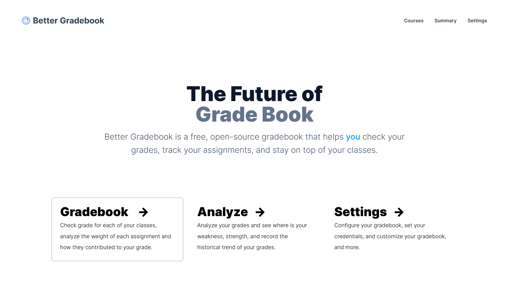

# Grade dashboard

Better grade book is a free, open-source grade book that helps you check your grades, track your assignments, and stay
on top of your classes.

## Features

- Check your grades
- Use `plot.ly` to visualize your grades
- Keep historical data of your grades, check your progress
- Analyze your strength and weakness
- An API for power users
- (TODO) Track your assignments

## Tech Stack

- `aiohttp` for the backend and spider
- `plotly` for server-side render of the charts
- `pandas` for data analysis
- `next.js` for the frontend